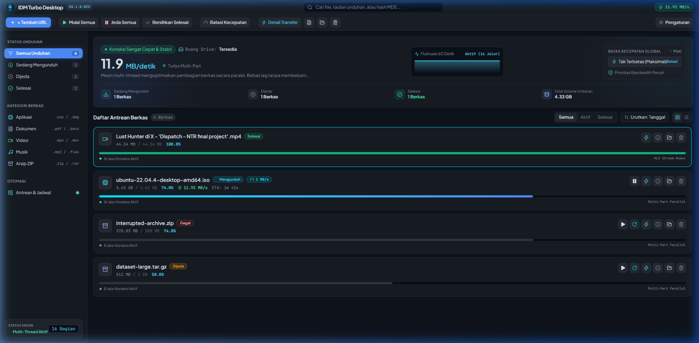
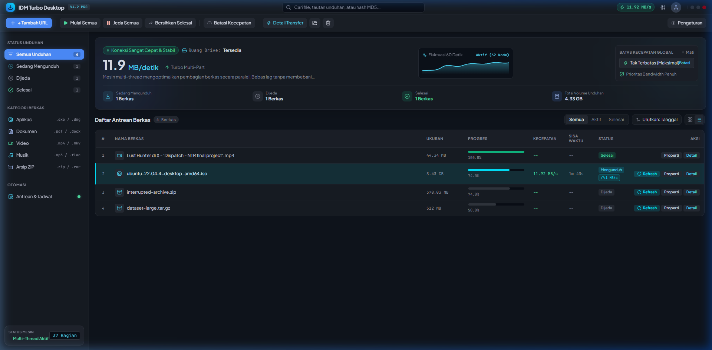
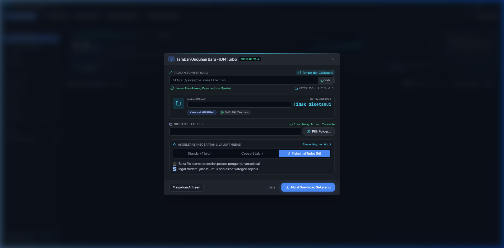
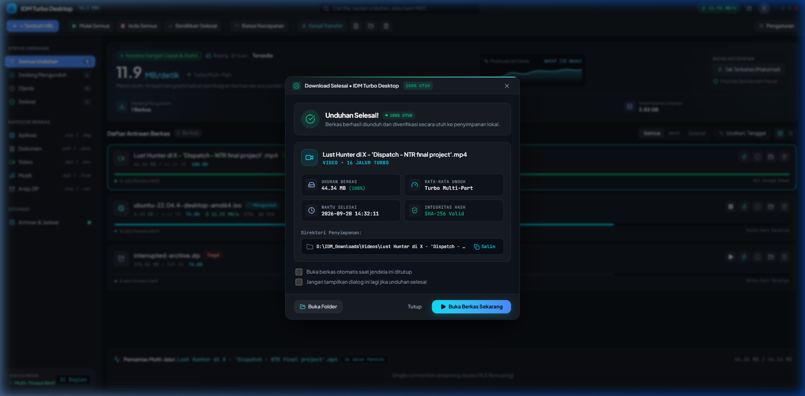
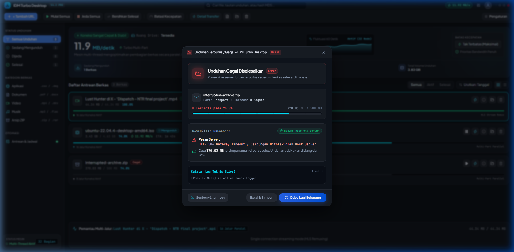
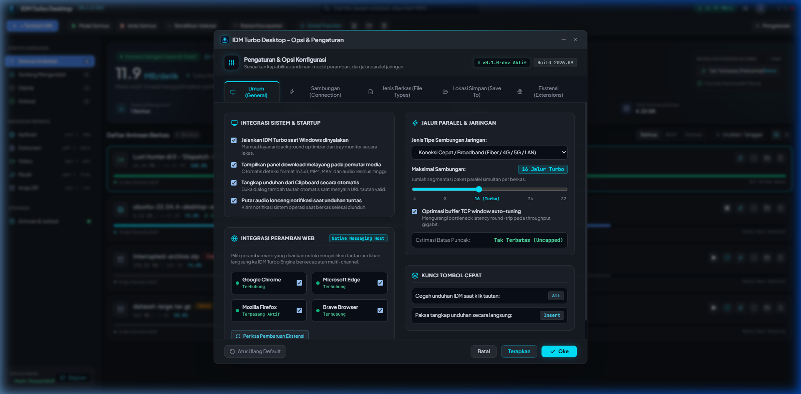
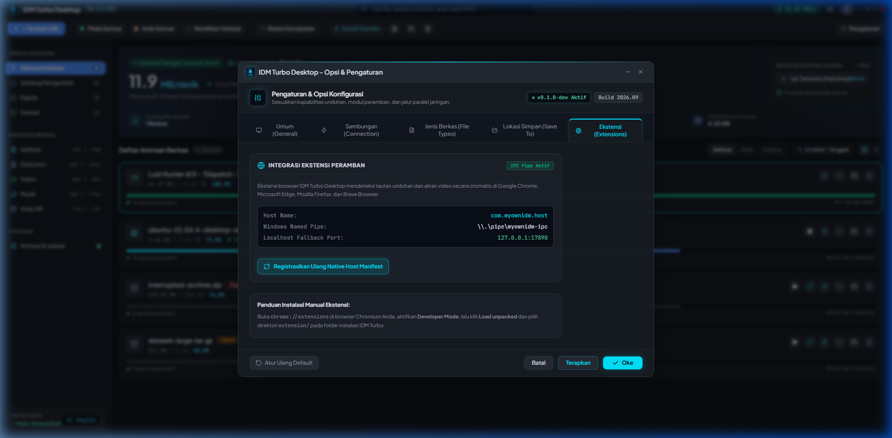

# IDM Turbo Desktop ⚡ (My Own IDM)

> **A High-Performance Desktop Internet Download Manager** built with **Tauri v2**, **Rust 2021**, **Svelte 5 (Runes)**, and styled after Google Stitch's **"Kinetic Telemetry"** dark-mode design system.

[](https://tauri.app)
[](https://www.rust-lang.org)
[](https://svelte.dev)
[](https://vitest.dev)
[](https://github.com/taiki-e/cargo-llvm-cov)
[](https://glitchtip.com)
[](https://opensource.org/licenses/MIT)

---

## 📸 Tampilan Antarmuka (UI Showcase & Screenshots)

### 1. Dashboard Utama — Tampilan Kartu Telemetri (Cards View)
Tampilan kartu interaktif dengan speedometer real-time, visualisasi waveform fluktuasi 60 detik, status antrean, dan bar segmen transfer aktif.



---

### 2. Dashboard Antrean Berkas — Tampilan Tabel (Table View)
Tampilan tabel data dense untuk manajemen unduhan massal dengan filter status, tombol kontrol cepat, bar progres beranimasi shimmer, serta pemantau multi-jalur 32 segmen di footer.



---

### 3. Dialog Tambah Unduhan Baru (Acrylic Glass Modal)
Shell modal transparan akrilik dengan deteksi clipboard otomatis, validasi TLS/HTTPS, inspeksi kemampuan resume server, dan pemilih 4, 8, atau 16 jalur thread turbo.



---

### 4. Dialog Unduhan Selesai & Integritas Berkas (Outcome Modal)
Animasi transisi in-place saat unduhan rampung dengan validasi hash SHA-256, info kecepatan rata-rata, serta tombol langsung *Buka Berkas Sekarang* atau *Buka Folder*.



---

### 5. Dialog Pemulihan & Diagnostik Kegagalan (Failure & Diagnostic Modal)
Tampilan diagnostik cerdas saat koneksi terputus dengan rincian pesan error server, live log stream, tombol pembaruan tautan unduhan, dan pelaporan masalah langsung ke GlitchTip.



---

### 6. Pengaturan & Opsi Konfigurasi Aplikasi
Pusat kendali preferensi unduhan, pengaturan jalur koneksi paralel (hingga 32 thread), batasan kecepatan jaringan, direktori penyimpanan default, dan seleksi bahasa (Indonesian / English).



---

### 7. Status Integrasi Ekstensi Peramban (Browser Extension Integration)
Pemantau status koneksi IPC Windows Named Pipe (`\\.\pipe\myownidm-ipc`), HTTP local fallback (`127.0.0.1:18888`), serta pendaftaran otomatis Native Messaging Host untuk Chrome, Edge, Firefox, dan Brave.



---

## 🌟 Fitur Unggulan (Key Features)

### 1. 🚀 Mesin Akselerasi Multi-Thread (Turbo Multi-Part Engine)
- **Dynamic Chunk Splitting**: Membagi berkas secara presisi per byte ke dalam 1 hingga 32 koneksi thread paralel melalui HTTP `Range` request.
- **Concurrent Block Pre-allocating Writer**: Pre-alokasi berkas sparse di disk dan penulisan chunk konkuren non-blocking dari beberapa worker thread tanpa race condition.
- **Resilient Auto-Resume**: Merekam progres per segmen secara berkala ke SQLite database. Jika koneksi terputus atau komputer restart, unduhan dapat dilanjutkan (*resumed*) tanpa mengulang dari 0%.
- **Token Bucket Rate Limiter**: Pembatas kecepatan unduhan cerdas yang dapat diatur secara global maupun per-tugas (500 KB/s, 1 MB/s, 2 MB/s, 5 MB/s, atau kustom).

### 2. 🎬 Universal Media & Stream Grabber
- **YouTube, Instagram Reels, TikTok, & X (Twitter)**: Terintegrasi dengan `yt-dlp` dan `ffmpeg` untuk memproses video, audio, dan remuxing otomatis ke format `.mp4` utuh berkualitas tinggi tanpa korup.
- **Native HLS / M3U8 Stream Downloader**: Mengunduh dan menggabungkan segmen `.ts` secara mandiri, lengkap dengan dekripsi roundtrip AES-128-CBC.

### 3. 🛡️ GlitchTip / Sentry Crash & Diagnostic Error Reporting
- **Crash Reporter Otomatis ([crash_reporter.rs](file:///d:/Development/my-own-idm/src-tauri/src/crash_reporter.rs))**: Menggunakan Sentry SDK v0.34 yang terhubung langsung ke GlitchTip project DSN dengan penanganan fatal panic dan backtrace.
- **Pembersihan Data Sensitif (Sanitizer)**: Secara otomatis menyamarkan token query (`token`, `auth`, `api_key`, `secret`, `signature`, `password`), kredensial otentikasi URL, serta direktori nama pengguna sistem (`C:\Users\***\`) sebelum dikirim.
- **Failover Multi-Tier untuk Ekstensi**: Ekstensi browser mengirimkan laporan error lewat IPC lokal ke desktop; jika aplikasi desktop sedang tertutup, ekstensi langsung mengirimkan payload error Sentry ke Store API GlitchTip secara mandiri.
- **Tombol "Laporkan Masalah"**: Hadir di dialog kegagalan unduhan dengan umpan balik reaktif (*Mengirimkan laporan...* -> *Laporan Terkirim*).

### 4. 🔄 Perbarui Tautan Unduhan (Refresh Download Address)
- Mengatasi tautan kadaluwarsa akibat token CDN sementara, signed URL (YouTube/GDrive), atau jeda waktu yang lama (`HTTP 403 Forbidden` / `HTTP 410 Gone`).
- **Preservasi Progres 100%**: Membuka browser untuk menangkap URL baru melalui ekstensi dan menyambungkan kembali unduhan tanpa menghapus file `.part` atau byte yang sudah terunduh.

### 5. 🪟 Jendela Transfer Mengambang Terdedikasi (Floating Window Lifecycle)
- Unduhan yang sedang aktif dapat dibuka di jendela floating native Tauri tersendiri (`/transfer?id=...`).
- **In-Place Lifecycle Transitions**: Jendela tidak tertutup mendadak saat selesai, melainkan bertransformasi secara mulus menjadi tampilan sukses (*Buka Berkas*, *Buka Folder*) dengan aura Emerald Glow, atau tampilan pemulihan kegagalan dengan aura Rose Red Glow.

### 6. 🌐 Dukungan Penuh Dua Bahasa (Bilingual i18n)
- Antarmuka mendukung penuh **Bahasa Indonesia** dan **English**, dapat diganti kapan saja melalui menu pengaturan dengan penyimpanan preferensi permanen di SQLite.

### 7. 🧩 Ekstensi Browser & Inter-Process Communication (IPC)
- **Floating Video Grabber Button**: Muncul otomatis di sisi video saat kursor melintas di YouTube, Instagram Reels, TikTok, atau Twitter/X.
- **Dual-Channel IPC**:
  - Windows Named Pipe (`\\.\pipe\myownidm-ipc`) dengan framing 4-byte little-endian length-prefixed JSON.
  - Localhost HTTP Server di `http://127.0.0.1:18888` dengan header CORS & Chrome Private Network Access (PNA).
  - Pendaftaran otomatis manifest Native Messaging Host untuk Chrome, Edge, Firefox, dan Brave.

### 8. 📊 Hybrid Thread-Safe Logging
- **In-Memory Ring Buffer**: Menyimpan 1.000 baris log diagnostik terkini untuk inspeksi live instan di UI tanpa membebani hard disk.
- **Daily Rotating File Logger**: Menulis berkas log harian di `%APPDATA%\com.myownidm.app\logs\idm.log`.

---

## 🏗️ Arsitektur Sistem (Architecture)

```mermaid
graph TD
    Browser[Browser / YouTube / TikTok / Web] -->|Click Floating Grabber| Ext[Chrome / Firefox / Edge Extension]
    Ext -->|Named Pipe / HTTP IPC :18888| IPC[src-tauri / ipc_server.rs]
    Ext -.->|Fallback Offline| GTDirect[GlitchTip Store API]
    
    subgraph Rust Core (src-tauri)
        IPC --> Manager[Download Manager]
        Manager --> Limiter[Token Bucket Rate Limiter]
        Limiter --> Probe[HTTP Probe / yt-dlp]
        Manager --> Worker[Segment Workers 1..32]
        Manager --> HLS[HLS / M3U8 AES-128 Engine]
        Worker --> Writer[Concurrent Pre-allocating Writer]
        Manager --> DB[(SQLite Database)]
        Manager --> Logger[Hybrid AppLogger]
        Manager --> CrashRep[GlitchTip Crash Reporter]
        CrashRep -->|Sanitized Event| GT[GlitchTip Error Server]
    end

    subgraph Desktop UI (Svelte 5 / TailwindCSS)
        Manager -->|Tauri Events| Store[idmStore.svelte.ts]
        Store --> Toolbar[Toolbar.svelte]
        Store --> Bento[TelemetryBento.svelte]
        Store --> Table[DownloadTable.svelte]
        Store --> SegmentVis[SegmentVisualizer.svelte]
        Store --> Modals[Add / Progress / Outcome / Refresh Modals]
        Store --> TransferWin[Floating Transfer Window]
    end
```

---

## 📂 Struktur Direktori (Directory Layout)

```
my-own-idm/
├── docs/
│   └── screenshots/              # Tangkapan layar antarmuka aplikasi
├── src/                          # Frontend Svelte 5 Single-Page Application
│   ├── app.css                   # Stitch "Kinetic Telemetry" CSS Tokens & Animations
│   ├── app.html                  # Google Fonts (Plus Jakarta Sans, JetBrains Mono)
│   ├── lib/
│   │   ├── idmStore.svelte.ts    # Central Reactive State Store (Runes $state, $derived)
│   │   ├── idmStore.test.ts      # Store & Event Unit Tests (Vitest)
│   │   ├── i18n.ts               # Kamus Lengkap Bahasa Indonesia & English
│   │   ├── types.ts              # TypeScript Interfaces & Utility Formatters
│   │   ├── types.test.ts         # Types & Formatters Unit Tests
│   │   └── version.ts            # Informasi Versi Aplikasi
│   ├── components/               # Komponen Modular UI
│   │   ├── Toolbar.svelte        # Two-Tier Navigation Toolbar
│   │   ├── Sidebar.svelte        # Kategori & Status Engine Sidebar
│   │   ├── TelemetryBento.svelte # Speedometer & Waveform Telemetri Dashboard
│   │   ├── DownloadTable.svelte  # Antrean Berkas (Cards & Table View)
│   │   ├── SegmentVisualizer.svelte # Pemantau Segmen Multi-Thread Live
│   │   ├── AddDownloadModal.svelte  # Dialog Tambah Unduhan Baru Akrilik
│   │   ├── DownloadProgressModal.svelte # Dialog Progres In-Flight Dual Bar
│   │   ├── DownloadOutcomeModal.svelte  # Dialog Notifikasi Selesai & Gagal
│   │   ├── RefreshLinkModal.svelte  # Dialog Pembaruan Tautan Kadaluwarsa
│   │   ├── PropertiesModal.svelte   # Dialog Rincian Berkas & Checksum
│   │   └── SettingsModal.svelte  # Dialog Preferensi & Integrasi Peramban
│   └── routes/
│       ├── +page.svelte          # Viewport Aplikasi Utama
│       └── transfer/
│           └── +page.svelte      # Jendela Transfer Mengambang Mandiri
├── src-tauri/                    # Backend Rust (Tauri v2)
│   ├── Cargo.toml                # Rust Dependencies & Build Profile (idm-turbo-desktop)
│   ├── tauri.conf.json           # Konfigurasi Jendela & Keamanan Tauri
│   └── src/
│       ├── lib.rs                # App Entry Point & Window Event Handler
│       ├── commands.rs           # Handler Perintah IPC Tauri
│       ├── crash_reporter.rs     # GlitchTip / Sentry & Sanitizer Data Sensitif
│       ├── db/                   # SQLite Storage Engine & CRUD Tests
│       ├── logger.rs             # Hybrid Ring Buffer & Rotating File Logger
│       ├── native_messaging.rs   # Registrasi Manifest Native Messaging Browser
│       ├── ipc_server.rs         # Server Windows Named Pipe & Localhost HTTP
│       ├── tray.rs               # System Tray Icon & Context Menu
│       └── engine/
│           ├── manager.rs        # Download Orchestrator & Task Evaluator
│           ├── worker.rs         # HTTP Range Worker Execution
│           ├── writer.rs         # Pre-allocated Concurrent File Writer
│           ├── probe.rs          # HTTP HEAD/GET Prober & Filename Parser
│           ├── limiter.rs        # Token Bucket Rate Limiter (Global & Task)
│           ├── hls.rs            # M3U8 Playlist Parser & AES-128 Decryptor
│           ├── ytdlp.rs          # Process Runner Stream & Parser yt-dlp
│           └── types.rs          # Tipe Data, Enums, & Serialisasi Rust
├── extension/                    # Ekstensi Browser (Manifest V3)
│   ├── manifest.json             # Deklarasi Izin Ekstensi V3
│   ├── background.js             # Media Traffic Sniffer & Pengirim IPC / GlitchTip
│   ├── content.js                # Penampil Tombol Unduh Video Mengambang
│   ├── content.css               # Styling Tombol Obsidian Glass & Cyan Glow
│   └── content.test.js           # Unit Test Ekstensi Browser (Vitest)
├── package.json                  # Konfigurasi Script & Dependensi NPM
├── svelte.config.js              # Konfigurasi Adapter Static SvelteKit
├── vite.config.js                # Konfigurasi Bundler Vite
└── vitest.config.ts              # Konfigurasi Vitest & Ambang Batas Coverage
```

---

## ⚡ Memulai (Getting Started)

### Prasyarat (Prerequisites)
Pastikan lingkungan pengembangan Anda telah terinstal:
1. **Node.js**: v18+ atau v20+ ([nodejs.org](https://nodejs.org))
2. **Rust & Cargo**: Versi stabil terbaru ([rustup.rs](https://rustup.rs))
3. **yt-dlp & ffmpeg** *(opsional untuk video YouTube / medsos)*:
   ```powershell
   winget install yt-dlp
   winget install ffmpeg
   ```

### Instalasi & Menjalankan Mode Pengembangan (Dev Mode)
1. Clone repositori ini:
   ```bash
   git clone https://github.com/threeadi/my-own-idm.git
   cd my-own-idm
   ```
2. Instal dependensi Node.js:
   ```bash
   npm install
   ```
3. Jalankan aplikasi dalam mode dev (Vite + Tauri):
   ```bash
   npm run tauri dev
   ```

### Membangun Versi Produksi (Production Build)
Untuk mengompilasi installer `.msi` atau `.exe` desktop siap pakai:
```bash
npm run tauri build
```
Berkas installer hasil kompilasi akan berada di `src-tauri/target/release/bundle/`.

---

## 🧩 Memasang Ekstensi Browser

1. Buka browser berbasis Chromium (Google Chrome, Microsoft Edge, Brave) atau Firefox.
2. Masuk ke halaman ekstensi:
   - **Chrome**: `chrome://extensions/`
   - **Edge**: `edge://extensions/`
3. Aktifkan **Developer mode** di sudut kanan atas.
4. Klik tombol **Load unpacked** (Muat yang belum dibongkar).
5. Arahkan ke folder `my-own-idm/extension`.
6. Ekstensi **My Own IDM Integration Module** siap digunakan! Saat memutar video di YouTube, Instagram Reels, TikTok, atau Twitter/X, tombol mengambang `⚡ Download this video [TURBO]` akan muncul otomatis di samping video.

---

## 🧪 Pengujian & Ambang Batas Coverage (> 80%)

Proyek ini memiliki suite pengujian otomatis komprehensif pada lapisan Frontend maupun Backend dengan ambang batas minimal **80% coverage**:

| Layer | Framework | Jumlah Test | Line Coverage | Status |
| :--- | :--- | :---: | :---: | :---: |
| **Frontend & Store** | Vitest (v8) | **99 / 99** (100%) | **97.04%** | ✅ Passed |
| **Backend Rust Core** | Cargo llvm-cov | **125 / 125** (100%) | **80.82%** | ✅ Passed |
| **TypeScript / Svelte Check** | svelte-check | **0 Errors, 0 Warnings** | — | ✅ Clean |

### Perintah Pengujian:

1. **Frontend Unit Tests + Coverage Report**:
   ```bash
   npm run test:coverage
   ```
2. **Backend Rust Unit Tests**:
   ```bash
   npm run test:backend
   ```
3. **Backend Rust Coverage (Summary Only)**:
   ```bash
   npm run test:backend:coverage
   ```
4. **Validasi Tipe TypeScript & SvelteKit**:
   ```bash
   npm run check
   ```

---

## 📄 Lisensi (License)

Proyek ini dilisensikan di bawah lisensi **MIT License** — silakan gunakan, pelajari, dan kembangkan secara bebas.
